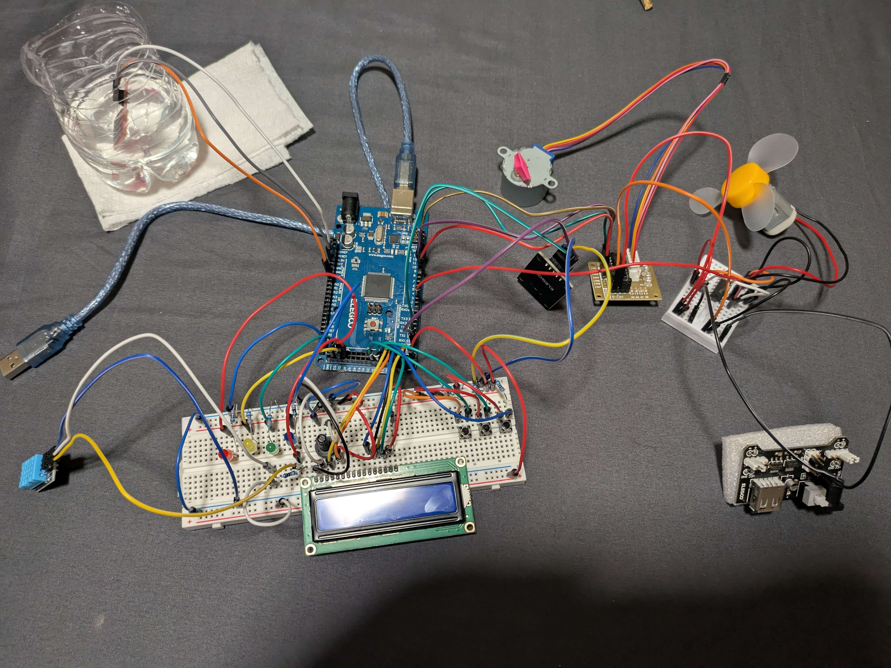
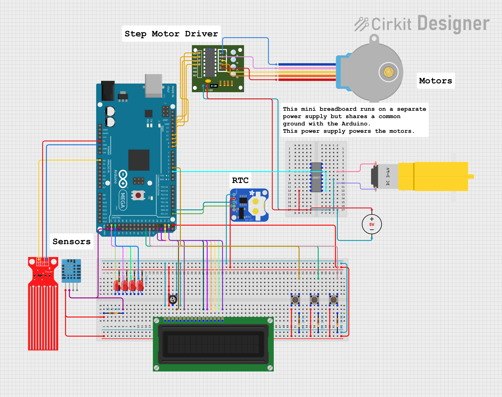
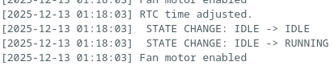

# CPE 301 Swamp Cooler Project

By Justin Juera <jjuera@unr.edu>

This repository contains the code and documentation for the CPE 301 Swamp
Cooler Project. Swamp coolers are devices that cool air by evaporating water.
Water has a high latent heat of vaporization, which means it can absorb a lot
of heat from the air before turning into vapor. This makes swamp coolers an
effective and energy-efficient way to cool indoor spaces, especially in dry
climates where the humidity is low.

The swamp cooler system in this project uses an Arduino Atmega2560 and various
sensors and actuators (described in the section below) to monitor and control
the operation of the swamp cooler.

It can monitor temperature, humidity, and water level, and adjust the fan speed
accordingly. It has an LCD screen to display the temperature and humidity of
the past minute, as well as the current system status. It also logs data with
timestamps using a real-time clock module through the serial monitor.

If you are a student looking to study or reuse parts of this code, please read
the License section at the bottom of this document.

## Components Used

- **Microcontroller**: [Arduino Atmega2560](https://www.arduino.cc/en/Main/ArduinoBoardMega2560)
  - This is the main controller for the swamp cooler system.
- **Temperature and Humidity Sensor**: [DHT11](https://docs.cirkitdesigner.com/component/a76bb123-3d3c-417d-b1f3-c8417efb7bc7)
  - Used to monitor both temperature and humidity levels.
- **Analog Water Level Detection Sensor**
  - Monitors the water level in the reservoir. If the water level is too low,
    the system will enter a non-operational state until the user refills the
    reservoir and presses the reset button.
- **LCD Display**: [LCD1602](https://docs.cirkitdesigner.com/component/e58c1528-e30a-4ff6-91ac-11313be5fedc/lcd1602)
  - Displays current temperature, humidity, and system status.
- **Stepper Motor**: [28BYJ-48](https://www.mouser.com/datasheet/2/758/stepd-01-data-sheet-1143075.pdf)
  - Used for the vents to control airflow direction.
- **Stepper Motor Driver**: [ULN2003](https://www.seeedstudio.com/document/pdf/ULN2003%20Datasheet.pdf)
  - Drives the stepper motor for vent control.
- **Real-Time Clock Module**: [DS1307](https://datasheets.maximintegrated.com/en/ds/DS1307.pdf)
  - Used to keep track of real-time for logging.
- **3-6V Motor with Propeller Fan Blade**
  - Provides airflow for the swamp cooler.
- **Motor Driver**: [L293D](https://docs.cirkitdesigner.com/component/f47b3186-2f6b-4ec1-9978-c189b4938930)
  - Used by the microcontroller to control the fan motor speed.
- **Power Supply Module**
  - Delivers the necessary power to the motors.
  - Note that the rest of the system is powered via USB from the microcontroller.
- **Push Buttons**
  - Used for user input to control vent direction, system reset, and system
    disable/enable.
- **LEDs**
  - Used for status indication.
- **Breadboard, jumper wires, and resistors**
  - Used for connecting components and building the circuit.

## System Overview

The swamp cooler system is designed to monitor environmental conditions and
adjust its operation accordingly. It uses a DHT11 sensor to measure temperature
and humidity, and an analog water level sensor to ensure there is sufficient
water in the reservoir. If the water level is too low, the system will not
operate until the user refills the reservoir and presses the reset button.

Note that the motors (fan and stepper motor for vents) are powered separately
from the microcontroller using a separate power supply module. There are two
breadboards used in this project: one for the microcontroller and sensors, and
another for the motors and their drivers. The motor breadboard and the
microcontroller breadboard are not electrically connected but share a common
ground. This separation is to prevent cases where the power supply for the
motors turns off while the microcontroller is still powered, which will cause
the motors to draw power from the microcontroller and potentially damage it.

### System States

The system has the following states:

- **Idle**: The system is powered on but not actively cooling.
  - Transitions to **Idle** state only during initial power-on. This is an
    implementation-specific detail where the state machine is designed so that
    each state has enter logic that runs once upon entering the state. When the
    system is powered on, it starts in the Idle state by default, but has to
    enter the Idle state again to run the enter logic.
  - Transitions to **Running** state if temperature exceeds threshold and water
    level is sufficient.
  - Transitions to **Error** state if water level is too low.
  - Transitions to **Disabled** state if user presses the enable/disable toggle
    button.
- **Running**: The system is actively cooling based on sensor readings.
  - Transitions to **Idle** state if temperature drops below threshold.
  - Transitions to **Error** state if water level is too low.
  - Transitions to **Disabled** state if user presses the enable/disable toggle
    button.
- **Error**: The system has detected an error condition (low water level) and is
  not operational. No cooling will occur until the user refills the reservoir and
  presses the reset button.
  - Transitions to **Idle** state if the user presses the reset button.
  - Transitions to **Disabled** state if user presses the enable/disable toggle
    button.
- **Disabled**: The user has manually disabled the system using the disable
  button. No cooling will occur until the user re-enables the system.
  - Transitions to **Idle** state if user presses the enable/disable toggle
    button.

## Circuit Image



## Schematic Diagram



Components used are described in the Components Used section above.

## System Demonstration

Below is a video demonstration of the swamp cooler system in operation:

<https://drive.google.com/file/d/1CNwVBzageFXINSoOLmAduGrb4Q404aej/view?usp=sharing>

Addendum: the video demonstrates logging with real-time clock timestamps. It
included hour/minute/second, but it did not include the year/month/day. A new
commit was added to include year/month/day in the log output. Here is an
updated screenshot of the log output with the full date and time:



## Environmental Impact

### Energy Efficiency

The swamp cooler system is designed to be energy efficient by only operating
when the temperature exceeds a certain threshold and if there is sufficient
water in the reservoir. This minimizes any unnecessary energy consumption.

In addition, the fan speed is controlled by how much the temperature exceeds
the threshold. This allows the system to adjust its cooling power based on the
current environmental conditions, only using minimal power when the temperature
is just above the threshold. This is seen in the `startMotor()` method in the
source code.

### Design Safety

As described in the System Overview section, the motors are powered separately
from the microcontroller using a separate power supply module. This design
choice prevents damage to the microcontroller in case the motor power supply is
turned off while the microcontroller is still powered.

In addition, the error state requires manual intervention from the user to
reset the system after a low water level condition is detected. This ensures
that the user is aware of the water level issue.

### Affordability

The components used in this project are chosen to be affordable. The total cost
of the kit containing all of the components used in this project is around
\$60-\$70. This makes it accessible for hobbyists who want to replicate or build
on this project.

In addition, I reduced the number of components needed by reusing them for
different but similar functions of the system. For example, the enable button
is the same physical button as the disable button; it toggles the system state
between enabled and disabled. By having the start/enable functionality be
implemented as an ISR, the user can press the button to disable the system
without worrying of holding the button too long and accidentally re-enabling
it.

The vent button also toggles the vent direction between two preset positions,
which simplifies the two vent states into a single button.

### Sustainability

The design of the swamp cooler system emphasizes sustainability by using
components that are widely available and can easily be replaced or upgraded.
Especially because the water level sensor is at risk of corrosion over time due
to constant exposure to water, it is important that the sensor can be easily
replaced. The water sensor used in this project is an inexpensive analog water
level detection sensor that can be easily swapped out if it fails, only
requiring to reconnect the jumper wires. Any water sensor that provides an
analog voltage output based on water level can be used as a replacement.

### Accessibility

Most of the user interface is placed in front of the user, while most of the
sensors and wiring are placed on the side or back of the system. This allows
the user to easily access the buttons and view the LCD display. In addition,
the wiring is mostly organized to allow for easy rebuilding or modification of
the circuit.

# License (read me if you are a student)

This project is licensed under the GPLv3 (or later) license. You are encouraged
to study and learn from this code.

If you copy, modify, or distribute any part of this project, you are required
to comply with the terms of the GPLv3 license. This includes preserving the
original copyright notice and providing access to the source code of any
derivative works.

This is to encourage open sharing of knowledge while discouraging any bad-faith
copying of the code. Because this license requires that derivative works
preserve the copyright notice, it will be clear if this code has been copied as
an attempt of plagiarism; otherwise, failure to preserve the copyright notice
would constitute a violation of the license. This still allows for modification
and learning, as independent adaptations and reimplementations from studying
the code are permitted by both the license and academic integrity policies.

You are free to modify and adapt this code (whether in part or in whole) as you
see fit, provided that any distributed derivative works remain licensed under
the GPLv3+ and include the appropriate attribution and license text.

An example of proper attribution of part of this code, such as reusing the
print integer function (`U0putint(int)` in the source) in your own code, would
be:

```c
/*
 * U0putint function
 * 
 * Originally written by Justin Juera
 * Source: https://github.com/jjuera-unr/cpe301-swamp-cooler
 * Licensed under GPLv3 or later
 *
 * This function has been reused here with attribution in accordance
 * with the original license.
 */
void U0putint(int, int = 0);
void U0putint(int value, int leadingZeros) {
    // render negative numbers correctly by prepending negative sign and printing
    // as positive
    if (value < 0) {
        U0putchar('-');
        value = -value;
    }

    const char digits[] = "0123456789";
    int temp = value;
    int count = 0;

    // count number of digits for leading zeros
    if (temp == 0) {
        count = 1;
    } else {
        while (temp > 0) {
            temp /= 10;
            count++;
        }
    }

    while (leadingZeros > count) {
        U0putchar('0');
        leadingZeros--;
    }

    if (value >= 10) {
        U0putint(value / 10, 0);
    }

    U0putchar(digits[value % 10]);
}
```
